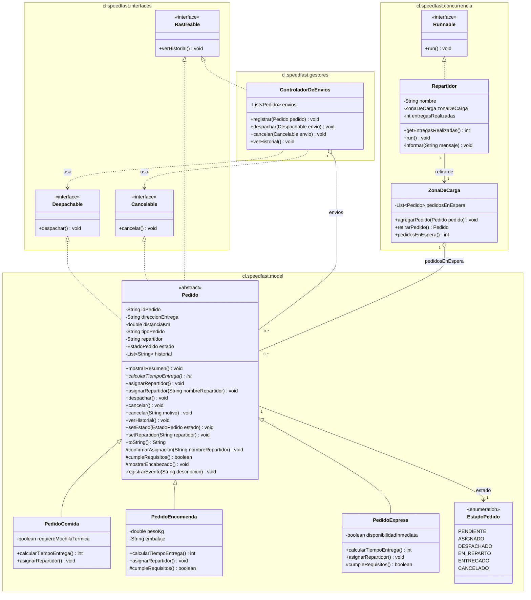

# SpeedFast

Sistema de gestión de pedidos para una empresa de reparto a domicilio.

Cada tipo de pedido estima su tiempo de entrega con una fórmula distinta y aplica su propio criterio de asignación de repartidor. Un controlador de envíos despacha, cancela y consulta el historial trabajando únicamente contra los contratos que los pedidos implementan.

La jornada de reparto se ejecuta de forma concurrente: los pedidos llegan a una zona de carga común y los repartidores los retiran al mismo tiempo, coordinados para que cada pedido lo entregue un único repartidor.

## Requisitos

- JDK 21
- IntelliJ IDEA

## Estructura

```
SpeedFast/
├── src/
│   └── cl/
│       └── speedfast/
│           ├── interfaces/
│           │   ├── Despachable.java
│           │   ├── Cancelable.java
│           │   ├── Rastreable.java
│           │   └── package-info.java
│           ├── model/
│           │   ├── Pedido.java
│           │   ├── PedidoComida.java
│           │   ├── PedidoEncomienda.java
│           │   ├── PedidoExpress.java
│           │   ├── EstadoPedido.java
│           │   └── package-info.java
│           ├── gestores/
│           │   ├── ControladorDeEnvios.java
│           │   └── package-info.java
│           ├── concurrencia/
│           │   ├── ZonaDeCarga.java
│           │   ├── Repartidor.java
│           │   └── package-info.java
│           └── main/
│               ├── Main.java
│               └── package-info.java
├── .idea/
├── SpeedFast.iml
└── README.md
```

| Paquete | Contenido |
|---|---|
| `cl.speedfast.interfaces` | Contratos de comportamiento |
| `cl.speedfast.model` | Modelo de dominio: la jerarquía de pedidos |
| `cl.speedfast.gestores` | Coordinación de las operaciones sobre los envíos |
| `cl.speedfast.concurrencia` | Recurso compartido y ejecución concurrente de las entregas |
| `cl.speedfast.main` | Punto de entrada de la aplicación |

## Modelo de clases

`PedidoComida`, `PedidoEncomienda` y `PedidoExpress` heredan de `Pedido`, que implementa las tres interfaces.

| Clase | Responsabilidad |
|---|---|
| `Pedido` | Clase abstracta. Datos y comportamiento comunes a todo pedido. |
| `PedidoComida` | Pedidos de restaurante. |
| `PedidoEncomienda` | Documentos y paquetes. |
| `PedidoExpress` | Compras de supermercado o farmacia. |
| `EstadoPedido` | Estados del pedido dentro del proceso de entrega. |
| `ControladorDeEnvios` | Registra los envíos y coordina despacho, cancelación e historial. |
| `ZonaDeCarga` | Recurso compartido. Almacena los pedidos en espera y controla su retiro. |
| `Repartidor` | Tarea concurrente. Retira pedidos de la zona de carga y los entrega. |
| `Main` | Punto de entrada. Ejecuta la simulación de la jornada. |




## Contratos

Cada interfaz declara una capacidad independiente. Una clase asume solo las que le corresponden y quien las consume no depende de implementaciones concretas.

| Interfaz | Método | Implementada por |
|---|---|---|
| `Despachable` | `despachar()` | `Pedido` y sus tres subclases |
| `Cancelable` | `cancelar()` | `Pedido` y sus tres subclases |
| `Rastreable` | `verHistorial()` | `Pedido` y sus tres subclases, `ControladorDeEnvios` |

Cada pedido rastrea sus propios eventos; el controlador rastrea las entregas realizadas.

`ControladorDeEnvios` recibe los envíos como `Despachable` y `Cancelable`, de modo que no conoce el tipo concreto del pedido que opera.

## Estados

| Estado | Significado |
|---|---|
| `PENDIENTE` | El pedido existe pero aún no tiene repartidor. |
| `ASIGNADO` | El pedido tiene un repartidor confirmado y puede despacharse. |
| `DESPACHADO` | El pedido salió a reparto y ya no admite cancelación. |
| `EN_REPARTO` | El pedido fue retirado de la zona de carga y va en camino a su destino. |
| `ENTREGADO` | El pedido llegó a su destino. |
| `CANCELADO` | El pedido fue anulado antes de salir a reparto. |

El recorrido habitual va de `PENDIENTE` a `ENTREGADO`. `CANCELADO` es la única salida anticipada y solo se admite mientras el pedido no haya salido a reparto.

## Pedido (clase abstracta)

Los atributos se reciben en el constructor y se exponen mediante *getters*. `direccionEntrega`, `repartidor` y `estado` admiten modificación posterior: los dos últimos cambian mientras el pedido avanza por la zona de carga.

| Atributo | Tipo | Acceso |
|---|---|---|
| `idPedido` | `String` | lectura |
| `direccionEntrega` | `String` | lectura y escritura |
| `distanciaKm` | `double` | lectura |
| `tipoPedido` | `String` | lectura |
| `repartidor` | `String` | lectura y escritura |
| `estado` | `EstadoPedido` | lectura y escritura |
| `historial` | `List<String>` | consulta mediante `verHistorial()` |

### Métodos

| Firma | Visibilidad | Descripción |
|---|---|---|
| `mostrarResumen()` | `public` | Imprime la ficha del pedido: tipo, identificador, dirección, distancia, repartidor, tiempo estimado y estado. |
| `calcularTiempoEntrega()` | `public abstract` | Tiempo estimado de entrega, en minutos. |
| `asignarRepartidor()` | `public` | Aplica el criterio de asignación del pedido y asigna el repartidor que le corresponde. |
| `asignarRepartidor(String)` | `public` | Asigna manualmente el pedido al repartidor indicado. |
| `despachar()` | `public` | Envía a reparto un pedido con repartidor asignado. |
| `cancelar()` | `public` | Cancela el pedido sin dejar constancia de un motivo. |
| `cancelar(String)` | `public` | Cancela el pedido dejando constancia del motivo. |
| `verHistorial()` | `public` | Imprime los eventos registrados por el pedido, en orden de ocurrencia. |
| `setEstado(EstadoPedido)` | `public` | Actualiza el estado del pedido. |
| `setRepartidor(String)` | `public` | Registra al repartidor que se hace cargo del pedido. |
| `toString()` | `public` | Describe el pedido en una línea: tipo, identificador, destino y estado. |
| `confirmarAsignacion(String)` | `protected` | Punto único de confirmación que comparten ambas sobrecargas. |
| `cumpleRequisitos()` | `protected` | Condición que debe cumplir el pedido para ser asignado. |
| `mostrarEncabezado()` | `protected` | Imprime el identificador, tipo y dirección del pedido. |

Cada asignación, despacho y cancelación queda anotada en el historial del pedido.

## Subclases

Cada subclase implementa `calcularTiempoEntrega()` y sobrescribe `asignarRepartidor()`.

| Clase | Tiempo de entrega | Criterio de asignación | Repartidor automático | Atributos propios |
|---|---|---|---|---|
| `PedidoComida` | 15 min + 2 min por km | El repartidor debe contar con mochila térmica | Makoto Kino | `requiereMochilaTermica: boolean` |
| `PedidoEncomienda` | 20 min + 1,5 min por km, ajustado a entero | Peso dentro del límite de 20 kg | Setsuna Meiou | `pesoKg: double`, `embalaje: String` |
| `PedidoExpress` | 10 min, más 5 min si la distancia supera los 5 km | Repartidor cercano con disponibilidad inmediata | Hotaru Tomoe | `disponibilidadInmediata: boolean` |

`PedidoEncomienda` y `PedidoExpress` sobrescriben además `cumpleRequisitos()`.

## ControladorDeEnvios

| Firma | Descripción |
|---|---|
| `registrar(Pedido)` | Incorpora un pedido a la gestión del controlador. |
| `despachar(Despachable)` | Envía a reparto el envío indicado. |
| `cancelar(Cancelable)` | Anula el envío indicado. |
| `verHistorial()` | Imprime los pedidos ya entregados y el repartidor que se hizo cargo de cada uno. |

## ZonaDeCarga

Los pedidos que esperan repartidor se acumulan en la zona de carga. Es la única estructura que los repartidores comparten y, por lo tanto, el punto donde se concentra la sincronización.

| Firma | Descripción |
|---|---|
| `agregarPedido(Pedido)` | Deposita un pedido a la espera de un repartidor. |
| `retirarPedido()` | Entrega el siguiente pedido en espera. Devuelve `null` cuando la zona queda vacía. |
| `pedidosEnEspera()` | Cantidad de pedidos que aún no tienen repartidor. |

Los tres métodos son `synchronized`: mientras un repartidor retira, ningún otro puede consultar ni modificar los pedidos en espera.

## Repartidor

Un repartidor es una tarea concurrente: implementa `Runnable` y su método `run()` retira pedidos de la zona de carga hasta agotarla.

| Atributo | Tipo | Descripción |
|---|---|---|
| `nombre` | `String` | Nombre con el que el repartidor se identifica en consola. |
| `zonaDeCarga` | `ZonaDeCarga` | Zona compartida desde la que retira sus pedidos. |
| `entregasRealizadas` | `int` | Entregas completadas durante el turno. |

| Firma | Descripción |
|---|---|
| `run()` | Retira y entrega pedidos hasta que la zona de carga queda vacía. |
| `getEntregasRealizadas()` | Entregas completadas por el repartidor. |

Por cada pedido retirado, `run()` lo marca `EN_REPARTO`, simula el trayecto con `Thread.sleep()` de duración aleatoria entre 500 y 1500 ms y lo deja `ENTREGADO`, informando cada paso en consola.

## Concurrencia

Los pedidos llegan a una zona de carga común y tres repartidores los retiran en paralelo. `Main` los ejecuta mediante un `ExecutorService` con un *pool* fijo de tres hilos y mantiene la simulación abierta hasta que todos terminan su turno.

| Aspecto | Resolución |
|---|---|
| Ejecución | `ExecutorService` con *pool* fijo de tres hilos |
| Recurso compartido | Una única instancia de `ZonaDeCarga` |
| Sección crítica | Comprobar si quedan pedidos y retirar uno |
| Mecanismo | Métodos `synchronized` sobre la zona de carga |
| Término | Espera acotada a un minuto; vencido el plazo, las tareas se detienen |
| Interrupción | Se restaura la marca del hilo y el repartidor termina su turno |

El reparto del trabajo entre los repartidores cambia entre ejecuciones, porque la planificación de los hilos depende de la máquina virtual y del sistema operativo. Lo que no cambia es el resultado: cada pedido se entrega una sola vez y la zona de carga queda vacía.

## Diseño

El sistema se organiza en torno a cinco piezas: una clase abstracta que reúne lo común a todo pedido, tres contratos de comportamiento, un gestor que opera sobre esos contratos, una zona de carga que custodia los pedidos en espera y un repartidor que ejecuta las entregas de forma concurrente.

### Reutilización

La clase `Pedido` reúne los atributos y el comportamiento que comparten los tres tipos de pedido: los datos del envío, el resumen, la asignación de repartidor, el despacho, la cancelación y el historial. Las subclases definen únicamente aquello que cambia entre un tipo y otro: la fórmula del tiempo de entrega, el criterio de asignación y la condición que debe cumplirse para asignar.

Las dos versiones de `asignarRepartidor` terminan llamando al mismo método `confirmarAsignacion(String)`. Con esto, la regla de que un pedido solo se asigna si cumple sus requisitos queda escrita una sola vez y se aplica por igual en la asignación automática y en la manual.

### Escalabilidad

Para incorporar un cuarto tipo de pedido basta con heredar de `Pedido` e implementar `calcularTiempoEntrega()`. El despacho, la cancelación y el historial ya vienen resueltos en la clase base. No es necesario modificar ninguna clase existente, tampoco el controlador: como `ControladorDeEnvios` recibe los envíos declarados como `Despachable` y `Cancelable`, puede operar sobre el tipo nuevo sin conocerlo.

Las capacidades también pueden crecer por separado. Cada interfaz declara un solo método, de manera que una clase que en el futuro solo necesite cancelarse implementa `Cancelable` sin asumir las demás responsabilidades.

### Acceso al recurso compartido

Los tres repartidores trabajan sobre la misma zona de carga, de modo que retirar un pedido es una operación que varios hilos pueden intentar a la vez. La sección crítica no es solo la extracción: comprobar si quedan pedidos y retirar uno deben ocurrir como una única operación indivisible. Si la comprobación quedara fuera de la protección, dos repartidores podrían verificar que hay pedidos disponibles antes de que alguno retire.

Por eso `retirarPedido()` es `synchronized` completo y no un bloque parcial. Una vez retirado, el pedido ya no está en la zona: desde ese momento un solo repartidor trabaja sobre él, y marcarlo `EN_REPARTO` y `ENTREGADO` no requiere protección adicional.

Un solo mecanismo basta para el problema. No se combinan bloqueos explícitos, semáforos ni contadores atómicos, que aquí solo agregarían complejidad sin resolver nada que el monitor de la zona no cubra.

`Thread.sleep()` puede lanzar `InterruptedException` mientras un repartidor simula un trayecto. En ese caso se restaura la marca de interrupción del hilo, se informa la situación y el repartidor termina su turno sin tomar más pedidos. `Main` aplica el mismo criterio cuando el hilo principal es interrumpido durante la espera.

### Mantenibilidad

Las responsabilidades están repartidas entre los paquetes: las reglas de negocio en el modelo, la coordinación de los envíos en el gestor, la custodia del recurso compartido en `ZonaDeCarga`, la ejecución de las entregas en `Repartidor` y el armado de la simulación en `Main`.

El estado del pedido se modela con el enum `EstadoPedido` y no con banderas booleanas separadas. De esta forma un pedido no puede quedar cancelado y despachado a la vez, y las transiciones válidas quedan concentradas en `despachar()` y `cancelar()`. Un cambio en la manera de cancelar tampoco obliga a modificar las clases que solo necesitan consultar el historial.

## Ejecución

Desde IntelliJ IDEA, ejecutar `Main`.

Desde la línea de comandos:

```bash
javac -encoding UTF-8 -d out/production/SpeedFast src/cl/speedfast/interfaces/*.java src/cl/speedfast/model/*.java src/cl/speedfast/gestores/*.java src/cl/speedfast/concurrencia/*.java src/cl/speedfast/main/*.java
```

```bash
java -cp out/production/SpeedFast cl.speedfast.main.Main
```

## Escenarios de prueba

`Main` simula una jornada de reparto con siete pedidos, una zona de carga y tres repartidores, en tres bloques:

1. **Zona de carga inicializada.** Los siete pedidos se registran en el controlador y se depositan en la zona de carga, que informa cada ingreso y la cantidad en espera.
2. **Retiro y entrega concurrente.** Los tres repartidores se ejecutan mediante `ExecutorService` sobre la misma zona. Cada uno retira un pedido, lo marca `EN_REPARTO`, simula el trayecto y lo deja `ENTREGADO`, repitiendo el ciclo hasta agotar la zona.
3. **Cierre de la jornada.** Se informa el estado final de cada pedido, el historial de entregas del controlador y el reparto del trabajo entre los repartidores.

El reparto entre los tres repartidores varía en cada ejecución. Lo que se mantiene es que los siete pedidos se entregan y ninguno se procesa dos veces.

### Comprobación de consistencia

El mensaje final no se imprime de forma incondicional. Antes de darlo por bueno, `Main` verifica tres condiciones:

| Condición | Comprobación |
|---|---|
| La zona quedó vacía | `pedidosEnEspera()` devuelve cero |
| Todos los pedidos llegaron | Los siete están en estado `ENTREGADO` |
| No hubo entregas duplicadas | La suma de entregas informadas por los repartidores es siete |

Si alguna falla, el programa informa la inconsistencia y detalla qué pedidos quedaron sin entregar, en lugar de anunciar un éxito que no ocurrió.

## Autora

Kamila Villablanca

## Contexto

Proyecto desarrollado para la asignatura Desarrollo Orientado a Objetos II, Duoc UC.
