# SpeedFast

Sistema de gestión de pedidos para una empresa de reparto a domicilio.

Cada tipo de pedido estima su tiempo de entrega con una fórmula propia y aplica su propio criterio de asignación de repartidor. Un controlador de envíos despacha, cancela y consulta el historial a través de los contratos que implementan los pedidos.

La jornada de reparto se ejecuta de forma concurrente: los pedidos se depositan en una zona de carga común y varios repartidores los retiran en paralelo, sin que un pedido sea entregado dos veces.

El sistema se opera desde una interfaz gráfica Java Swing que permite registrar, editar, eliminar y listar repartidores, pedidos y entregas. La información se almacena en una base de datos MySQL, a la que la aplicación accede mediante JDBC a través de una clase DAO por entidad.

## Requisitos

- JDK 21
- IntelliJ IDEA
- MySQL 8
- MySQL Connector/J 9.3.0, incluido en `lib/`

## Estructura

```
SpeedFast/
├── bd/
│   └── script_estructura.sql
├── lib/
│   └── mysql-connector-j-9.3.0.jar
├── src/
│   └── cl/
│       └── speedfast/
│           ├── interfaces/
│           │   ├── Despachable.java
│           │   ├── Cancelable.java
│           │   ├── Rastreable.java
│           │   └── package-info.java
│           ├── modelo/
│           │   ├── Pedido.java
│           │   ├── PedidoComida.java
│           │   ├── PedidoEncomienda.java
│           │   ├── PedidoExpress.java
│           │   ├── EstadoPedido.java
│           │   ├── TipoPedido.java
│           │   ├── Repartidor.java
│           │   ├── Entrega.java
│           │   └── package-info.java
│           ├── dao/
│           │   ├── ConexionDB.java
│           │   ├── PedidoDAO.java
│           │   ├── RepartidorDAO.java
│           │   ├── EntregaDAO.java
│           │   └── package-info.java
│           ├── gestores/
│           │   ├── ControladorDeEnvios.java
│           │   └── package-info.java
│           ├── concurrencia/
│           │   ├── ZonaDeCarga.java
│           │   ├── Repartidor.java
│           │   └── package-info.java
│           ├── vista/
│           │   ├── CampoValidado.java
│           │   ├── Validaciones.java
│           │   ├── VentanaPrincipal.java
│           │   ├── VentanaGestion.java
│           │   ├── VentanaRepartidores.java
│           │   ├── VentanaPedidos.java
│           │   ├── VentanaEntregas.java
│           │   └── package-info.java
│           └── main/
│               ├── Main.java
│               └── package-info.java
├── .idea/
├── SpeedFast.iml
└── README.md
```

| Paquete | Contenido |
|---|---|
| `cl.speedfast.interfaces` | Contratos de comportamiento |
| `cl.speedfast.modelo` | Modelo de dominio: pedidos, repartidores y entregas |
| `cl.speedfast.dao` | Conexión JDBC y acceso a las tablas |
| `cl.speedfast.gestores` | Coordinación de las operaciones sobre los envíos |
| `cl.speedfast.concurrencia` | Recurso compartido y ejecución concurrente de las entregas |
| `cl.speedfast.vista` | Ventanas Swing |
| `cl.speedfast.main` | Punto de entrada |

| Carpeta | Contenido |
|---|---|
| `bd/` | Script de creación de la base de datos `speedfast_db` |
| `lib/` | Driver JDBC de MySQL, enlazado como biblioteca del módulo en `SpeedFast.iml` |

## Modelo de clases

`PedidoComida`, `PedidoEncomienda` y `PedidoExpress` heredan de `Pedido`, que implementa las tres interfaces.

| Clase | Responsabilidad |
|---|---|
| `Pedido` | Clase abstracta. Datos y comportamiento comunes a todo pedido. |
| `PedidoComida` | Pedidos de restaurante. |
| `PedidoEncomienda` | Documentos y paquetes. |
| `PedidoExpress` | Compras de supermercado o farmacia. |
| `EstadoPedido` | Estados del pedido dentro del proceso de entrega. |
| `TipoPedido` | Tipos de pedido. Relaciona cada subclase con su valor en la tabla `pedidos`. |
| `Repartidor` (`modelo`) | Repartidor registrado. Fila de la tabla `repartidores`. |
| `Entrega` | Relación entre un pedido y un repartidor, con fecha y hora. Fila de la tabla `entregas`. |
| `ConexionDB` | URL, credenciales y apertura de conexiones JDBC. |
| `RepartidorDAO` | CRUD de la tabla `repartidores`. |
| `PedidoDAO` | CRUD de la tabla `pedidos`. |
| `EntregaDAO` | CRUD de la tabla `entregas`. |
| `ControladorDeEnvios` | Registro de envíos, despacho, cancelación e historial. |
| `ZonaDeCarga` | Recurso compartido. Pedidos en espera de repartidor. |
| `Repartidor` (`concurrencia`) | Tarea concurrente. Retira pedidos de la zona de carga y los entrega. |
| `Main` | Punto de entrada. Abre la ventana principal. |

```mermaid
---
config:
  class:
    hierarchicalNamespaces: false
---
classDiagram
    direction TB

    namespace cl.speedfast.interfaces {
        class Despachable {
            <<interface>>
            +despachar() void
        }
        class Cancelable {
            <<interface>>
            +cancelar() void
        }
        class Rastreable {
            <<interface>>
            +verHistorial() void
        }
    }

    namespace cl.speedfast.modelo {
        class Pedido {
            <<abstract>>
            -String idPedido
            -String direccionEntrega
            -double distanciaKm
            -String tipoPedido
            -String repartidor
            -EstadoPedido estado
            -List~String~ historial
            +mostrarResumen() void
            +calcularTiempoEntrega()* int
            +asignarRepartidor() void
            +asignarRepartidor(String nombreRepartidor) void
            +despachar() void
            +cancelar() void
            +cancelar(String motivo) void
            +verHistorial() void
            +setIdPedido(String idPedido) void
            +setEstado(EstadoPedido estado) void
            +setRepartidor(String repartidor) void
            +toString() String
            #confirmarAsignacion(String nombreRepartidor) void
            #cumpleRequisitos() boolean
            #mostrarEncabezado() void
            -registrarEvento(String descripcion) void
        }
        class PedidoComida {
            -boolean requiereMochilaTermica
            +calcularTiempoEntrega() int
            +asignarRepartidor() void
        }
        class PedidoEncomienda {
            -double pesoKg
            -String embalaje
            +calcularTiempoEntrega() int
            +asignarRepartidor() void
            #cumpleRequisitos() boolean
        }
        class PedidoExpress {
            -boolean disponibilidadInmediata
            +calcularTiempoEntrega() int
            +asignarRepartidor() void
            #cumpleRequisitos() boolean
        }
        class EstadoPedido {
            <<enumeration>>
            PENDIENTE
            ASIGNADO
            DESPACHADO
            EN_REPARTO
            ENTREGADO
            CANCELADO
        }
        class TipoPedido {
            <<enumeration>>
            COMIDA
            ENCOMIENDA
            EXPRESS
            +crearPedido(String idPedido, String direccion) Pedido
            +de(Pedido pedido)$ TipoPedido
        }
        class RepartidorRegistrado["Repartidor"] {
            -int id
            -String nombre
            +setId(int id) void
            +toString() String
        }
        class Entrega {
            -int id
            -int idPedido
            -int idRepartidor
            -LocalDate fecha
            -LocalTime hora
            +setId(int id) void
        }
    }

    namespace cl.speedfast.dao {
        class ConexionDB {
            -String URL
            -String USUARIO
            -String CONTRASENA
            +conectar()$ Connection
        }
        class RepartidorDAO {
            +create(Repartidor repartidor) void
            +readAll() List~Repartidor~
            +update(Repartidor repartidor) boolean
            +delete(int id) boolean
        }
        class PedidoDAO {
            +create(Pedido pedido) void
            +readAll() List~Pedido~
            +update(Pedido pedido) boolean
            +delete(int id) boolean
        }
        class EntregaDAO {
            +create(Entrega entrega) void
            +readAll() List~Entrega~
            +update(Entrega entrega) boolean
            +delete(int id) boolean
        }
    }

    namespace cl.speedfast.gestores {
        class ControladorDeEnvios {
            -List~Pedido~ envios
            +registrar(Pedido pedido) void
            +despachar(Despachable envio) void
            +cancelar(Cancelable envio) void
            +verHistorial() void
        }
    }

    namespace cl.speedfast.concurrencia {
        class Runnable {
            <<interface>>
            +run() void
        }
        class ZonaDeCarga {
            -List~Pedido~ pedidosEnEspera
            +agregarPedido(Pedido pedido) void
            +retirarPedido() Pedido
            +pedidosEnEspera() int
        }
        class Repartidor {
            -String nombre
            -ZonaDeCarga zonaDeCarga
            -int entregasRealizadas
            +getEntregasRealizadas() int
            +run() void
            -informar(String mensaje) void
        }
    }

    Despachable <|.. Pedido
    Cancelable <|.. Pedido
    Rastreable <|.. Pedido
    Rastreable <|.. ControladorDeEnvios

    Pedido <|-- PedidoComida
    Pedido <|-- PedidoEncomienda
    Pedido <|-- PedidoExpress

    Pedido "1" --> "1" EstadoPedido : estado
    ControladorDeEnvios "1" o-- "0..*" Pedido : envios

    ControladorDeEnvios ..> Despachable : usa
    ControladorDeEnvios ..> Cancelable : usa

    TipoPedido ..> Pedido : crea
    Entrega --> Pedido : idPedido
    Entrega --> RepartidorRegistrado : idRepartidor

    PedidoDAO ..> ConexionDB : usa
    RepartidorDAO ..> ConexionDB : usa
    EntregaDAO ..> ConexionDB : usa
    PedidoDAO ..> Pedido : persiste
    PedidoDAO ..> TipoPedido : usa
    RepartidorDAO ..> RepartidorRegistrado : persiste
    EntregaDAO ..> Entrega : persiste

    Runnable <|.. Repartidor
    ZonaDeCarga "1" o-- "0..*" Pedido : pedidosEnEspera
    Repartidor "3" --> "1" ZonaDeCarga : retira de

    classDef contrato fill:#e8f5e9,stroke:#2e7d32,color:#1b5e20
    classDef modelo fill:#fff3e0,stroke:#e65100,color:#5d2f00
    classDef gestor fill:#e3f2fd,stroke:#1565c0,color:#0d3c67
    classDef concurrente fill:#f3e5f5,stroke:#6a1b9a,color:#3d0d55
    classDef datos fill:#fce4ec,stroke:#ad1457,color:#560027

    cssClass "Despachable,Cancelable,Rastreable" contrato
    cssClass "Pedido,PedidoComida,PedidoEncomienda,PedidoExpress,EstadoPedido,TipoPedido,RepartidorRegistrado,Entrega" modelo
    cssClass "ConexionDB,PedidoDAO,RepartidorDAO,EntregaDAO" datos
    cssClass "ControladorDeEnvios" gestor
    cssClass "Runnable,ZonaDeCarga,Repartidor" concurrente
```



## Contratos

| Interfaz | Método | Implementada por |
|---|---|---|
| `Despachable` | `despachar()` | `Pedido` y sus tres subclases |
| `Cancelable` | `cancelar()` | `Pedido` y sus tres subclases |
| `Rastreable` | `verHistorial()` | `Pedido` y sus tres subclases, `ControladorDeEnvios` |

`ControladorDeEnvios` recibe los envíos como `Despachable` y `Cancelable`, sin depender del tipo concreto de pedido.

## Estados

| Estado | Significado |
|---|---|
| `PENDIENTE` | El pedido existe pero aún no tiene repartidor. |
| `ASIGNADO` | El pedido tiene un repartidor confirmado y puede despacharse. |
| `DESPACHADO` | El pedido salió a reparto y ya no admite cancelación. |
| `EN_REPARTO` | El pedido fue retirado de la zona de carga y va en camino a su destino. |
| `ENTREGADO` | El pedido llegó a su destino. |
| `CANCELADO` | El pedido fue anulado antes de salir a reparto. |

## Pedido (clase abstracta)

| Atributo | Tipo | Acceso |
|---|---|---|
| `idPedido` | `String` | lectura y escritura |
| `direccionEntrega` | `String` | lectura |
| `distanciaKm` | `double` | lectura |
| `tipoPedido` | `String` | lectura |
| `repartidor` | `String` | lectura y escritura |
| `estado` | `EstadoPedido` | lectura y escritura |
| `historial` | `List<String>` | consulta mediante `verHistorial()` |

| Firma | Visibilidad | Descripción |
|---|---|---|
| `mostrarResumen()` | `public` | Imprime la ficha del pedido. |
| `calcularTiempoEntrega()` | `public abstract` | Tiempo estimado de entrega, en minutos. |
| `asignarRepartidor()` | `public` | Asigna el repartidor según el criterio del tipo de pedido. |
| `asignarRepartidor(String)` | `public` | Asigna el pedido al repartidor indicado. |
| `despachar()` | `public` | Envía a reparto un pedido con repartidor asignado. |
| `cancelar()` | `public` | Cancela el pedido sin motivo. |
| `cancelar(String)` | `public` | Cancela el pedido con el motivo indicado. |
| `verHistorial()` | `public` | Imprime los eventos del pedido en orden de ocurrencia. |
| `setIdPedido(String)` | `public` | Registra el identificador asignado por la base de datos. |
| `setEstado(EstadoPedido)` | `public` | Actualiza el estado del pedido. |
| `setRepartidor(String)` | `public` | Registra al repartidor a cargo del pedido. |
| `toString()` | `public` | Tipo, identificador, destino y estado en una línea. |
| `confirmarAsignacion(String)` | `protected` | Confirmación común a ambas sobrecargas de `asignarRepartidor`. |
| `cumpleRequisitos()` | `protected` | Condición para asignar el pedido. |
| `mostrarEncabezado()` | `protected` | Imprime identificador, tipo y dirección. |

Cada asignación, despacho y cancelación queda anotada en el historial del pedido.

## Subclases

| Clase | Tiempo de entrega | Criterio de asignación | Repartidor automático | Atributos propios |
|---|---|---|---|---|
| `PedidoComida` | 15 min + 2 min por km | Mochila térmica | Makoto Kino | `requiereMochilaTermica: boolean` |
| `PedidoEncomienda` | 20 min + 1,5 min por km, redondeado | Peso de hasta 20 kg | Setsuna Meiou | `pesoKg: double`, `embalaje: String` |
| `PedidoExpress` | 10 min, más 5 min sobre 5 km | Disponibilidad inmediata | Hotaru Tomoe | `disponibilidadInmediata: boolean` |

Cada subclase implementa `calcularTiempoEntrega()` y sobrescribe `asignarRepartidor()` y `mostrarResumen()`. `PedidoEncomienda` y `PedidoExpress` sobrescriben además `cumpleRequisitos()`.

## ControladorDeEnvios

| Firma | Descripción |
|---|---|
| `registrar(Pedido)` | Incorpora un pedido a la gestión del controlador. |
| `getEnvios()` | Envíos registrados, en orden de incorporación. |
| `buscarIdRegistrado(String)` | Identificador ya en uso, sin distinguir mayúsculas de minúsculas. |
| `despachar(Despachable)` | Envía a reparto el envío indicado. |
| `cancelar(Cancelable)` | Anula el envío indicado. |
| `verHistorial()` | Imprime los pedidos entregados y su repartidor. |

## ZonaDeCarga

| Firma | Descripción |
|---|---|
| `agregarPedido(Pedido)` | Deposita un pedido a la espera de un repartidor. |
| `retirarPedido()` | Entrega el siguiente pedido en espera, o `null` si la zona está vacía. |
| `pedidosEnEspera()` | Cantidad de pedidos sin repartidor. |

Los tres métodos son `synchronized`.

## Repartidor

| Atributo | Tipo | Descripción |
|---|---|---|
| `nombre` | `String` | Nombre mostrado en consola. |
| `zonaDeCarga` | `ZonaDeCarga` | Zona compartida de la que retira pedidos. |
| `entregasRealizadas` | `int` | Entregas completadas durante el turno. |

| Firma | Descripción |
|---|---|
| `run()` | Retira y entrega pedidos hasta vaciar la zona de carga. |
| `getEntregasRealizadas()` | Entregas completadas por el repartidor. |

Por cada pedido retirado, `run()` lo marca `EN_REPARTO`, simula el trayecto con `Thread.sleep()` de entre 500 y 1500 ms y lo deja `ENTREGADO`.

## Concurrencia

| Aspecto | Resolución |
|---|---|
| Ejecución | `ExecutorService` con *pool* fijo de tres hilos |
| Recurso compartido | Una única instancia de `ZonaDeCarga` |
| Sección crítica | Comprobar si quedan pedidos y retirar uno |
| Mecanismo | Métodos `synchronized` sobre la zona de carga |
| Término | Espera acotada; vencido el plazo, las tareas se detienen |
| Interrupción | Se restaura la marca del hilo y el repartidor termina su turno |

La distribución de pedidos entre repartidores varía entre ejecuciones; cada pedido se entrega una sola vez.

## Base de datos

Base de datos MySQL `speedfast_db`, creada por `bd/script_estructura.sql`.

| Tabla | Columnas | Clave primaria | Claves foráneas |
|---|---|---|---|
| `repartidores` | `id`, `nombre` | `id`, `AUTO_INCREMENT` | — |
| `pedidos` | `id`, `direccion`, `tipo`, `estado` | `id`, `AUTO_INCREMENT` | — |
| `entregas` | `id`, `id_pedido`, `id_repartidor`, `fecha`, `hora` | `id`, `AUTO_INCREMENT` | `id_pedido` → `pedidos(id)`, `id_repartidor` → `repartidores(id)` |

Un repartidor puede realizar muchas entregas y un pedido puede tener una o varias; cada entrega corresponde a un pedido y a un repartidor.

| Columna | Tipo | Valores |
|---|---|---|
| `pedidos.tipo` | `ENUM` | `COMIDA`, `ENCOMIENDA`, `EXPRESS` |
| `pedidos.estado` | `ENUM` | `PENDIENTE`, `EN_REPARTO`, `ENTREGADO` |
| `entregas.fecha` | `DATE` | |
| `entregas.hora` | `TIME` | |

La distancia y los datos propios de cada tipo de pedido no se almacenan. Un pedido leído desde la base de datos los recibe con valores neutros.

### Conexión

| Parámetro | Valor |
|---|---|
| Clase | `ConexionDB` |
| Método | `conectar()`, mediante `DriverManager` |
| URL | `jdbc:mysql://localhost:3306/speedfast_db` |
| Usuario | `root` |
| Contraseña | Constante `CONTRASENA` de `ConexionDB` |

### Acceso a datos

`RepartidorDAO`, `PedidoDAO` y `EntregaDAO` exponen las mismas cuatro operaciones sobre su tabla.

| Método | SQL | Resultado |
|---|---|---|
| `create(objeto)` | `INSERT` | Asigna al objeto el ID generado |
| `readAll()` | `SELECT` | Lista de objetos ordenada por ID |
| `update(objeto)` | `UPDATE ... WHERE id = ?` | `true` si el registro existía |
| `delete(id)` | `DELETE ... WHERE id = ?` | `true` si el registro existía |

Las operaciones usan `PreparedStatement` y cierran conexión, sentencia y `ResultSet` con *try-with-resources*. Ante un error, el DAO relanza la `SQLException` con el nombre de la operación fallida y la ventana la informa con `JOptionPane`. Eliminar un repartidor o un pedido que tiene entregas registradas se rechaza con un mensaje que lo indica.

## Interfaz gráfica

| Clase | Rol |
|---|---|
| `VentanaPrincipal` | Accesos a la gestión de cada entidad |
| `VentanaGestion` | Clase abstracta. Formulario, tabla y flujo común del CRUD |
| `VentanaRepartidores` | CRUD de repartidores |
| `VentanaPedidos` | CRUD de pedidos |
| `VentanaEntregas` | CRUD de entregas |
| `CampoValidado` | Campo de formulario con validación mientras se escribe |
| `Validaciones` | Reglas de validación combinables |

### VentanaPrincipal

Abre `VentanaRepartidores`, `VentanaPedidos` y `VentanaEntregas`. Cada ventana se crea una vez, se reutiliza en las aperturas siguientes y recarga sus datos al mostrarse. Registrar, editar o eliminar un repartidor o un pedido recarga la ventana de entregas.

### VentanaGestion

Organiza cada ventana en formulario, `JTable` y botones. La primera columna de la tabla es el ID; las celdas no son editables y la tabla se ordena al pulsar un encabezado.

| Acción | Comportamiento |
|---|---|
| Selección de fila | Carga el registro en el formulario |
| Registrar | Valida el formulario y llama a `create` |
| Editar | Exige una fila seleccionada, valida el formulario y llama a `update` con el ID de la fila |
| Eliminar | Exige una fila seleccionada, pide confirmación y llama a `delete` |
| Limpiar | Quita la selección y vacía el formulario |

Tras una operación exitosa la tabla se recarga con `readAll()`, el formulario se limpia y un mensaje informa el resultado.

### VentanaRepartidores

| Campo | Componente | Condiciones |
|---|---|---|
| Nombre | `JTextField` | Obligatorio · entre 3 y 100 caracteres · debe incluir letras |

### VentanaPedidos

| Campo | Componente | Condiciones |
|---|---|---|
| Dirección | `JTextField` | Obligatoria · entre 5 y 100 caracteres · debe incluir letras |
| Tipo | `JComboBox<TipoPedido>` | `COMIDA`, `ENCOMIENDA`, `EXPRESS` |
| Estado | `JComboBox<EstadoPedido>` | `PENDIENTE`, `EN_REPARTO`, `ENTREGADO` |

| Columna | Columna SQL |
|---|---|
| ID | `pedidos.id` |
| Dirección | `pedidos.direccion` |
| Tipo | `pedidos.tipo` |
| Estado | `pedidos.estado` |

### VentanaEntregas

| Campo | Componente | Condiciones |
|---|---|---|
| Pedido | `JComboBox<Pedido>` | Obligatorio · cargado con `PedidoDAO.readAll()` |
| Repartidor | `JComboBox<Repartidor>` | Obligatorio · cargado con `RepartidorDAO.readAll()` |
| Fecha | `JTextField` | Obligatoria · fecha válida `dd-mm-aaaa` |
| Hora | `JTextField` | Obligatoria · hora válida `hh:mm` |

Los combos muestran `id - dirección` e `id - nombre` y guardan el objeto completo, del que se obtiene el ID que se almacena en `entregas`. Se recargan junto con la tabla y conservan la opción elegida si sigue existiendo. El formulario limpio propone la fecha y hora actuales.

| Columna | Contenido |
|---|---|
| ID | `entregas.id` |
| Pedido | `id - dirección` del pedido |
| Repartidor | `id - nombre` del repartidor |
| Fecha | `entregas.fecha` |
| Hora | `entregas.hora` |

### Validaciones

| Regla | Exigencia |
|---|---|
| `obligatorio(mensaje)` | El campo tiene contenido |
| `longitudEntre(min, max)` | La extensión está dentro del rango |
| `contieneLetras(mensaje)` | El texto incluye al menos una letra |
| `fecha()` | Fecha existente con formato `dd-mm-aaaa` |
| `hora()` | Hora entre 00:00 y 23:59 con formato `hh:mm` |

`Validaciones.todas(...)` combina reglas y devuelve el primer motivo de rechazo. Salvo `obligatorio`, las reglas aceptan el campo vacío.

### CampoValidado

Agrupa etiqueta, cuadro de texto y mensaje. Un `DocumentListener` aplica la regla ante cada cambio del contenido.

| Situación | Comportamiento |
|---|---|
| Formulario recién abierto, limpiado o cargado desde la tabla | Sin advertencias |
| Valor inaceptable | Borde rojo y motivo bajo el campo |
| Valor corregido | Se retiran el borde y el mensaje |

## Diseño

| Aspecto | Resolución |
|---|---|
| Reutilización | `Pedido` concentra lo común; las subclases definen fórmula de tiempo, criterio de asignación y requisitos. Ambas sobrecargas de `asignarRepartidor` confirman en `confirmarAsignacion(String)`. `VentanaGestion` concentra el flujo CRUD de las tres ventanas, que solo definen su formulario y sus llamadas al DAO. |
| Escalabilidad | Un tipo de pedido nuevo hereda de `Pedido` e implementa `calcularTiempoEntrega()`; su persistencia requiere agregarlo a `TipoPedido` y a la columna `pedidos.tipo`. Cada interfaz declara un solo método. |
| Acceso al recurso compartido | `retirarPedido()` es `synchronized` completo: la comprobación y el retiro son indivisibles. |
| Estados | El enum `EstadoPedido` concentra las transiciones válidas en `despachar()` y `cancelar()`. |
| Separación de responsabilidades | Reglas de negocio en el modelo, acceso a datos en los DAO, coordinación en el gestor, concurrencia en `ZonaDeCarga` y `Repartidor`, e interacción con el usuario en la vista. El SQL reside solo en los DAO. |

## Ejecución

La base de datos se crea con `bd/script_estructura.sql` y la contraseña del usuario `root` se define en `ConexionDB`. `Main` abre `VentanaPrincipal` en el hilo de despacho de eventos de Swing.

```bash
javac -encoding UTF-8 -cp lib/mysql-connector-j-9.3.0.jar -d out/production/SpeedFast src/cl/speedfast/interfaces/*.java src/cl/speedfast/modelo/*.java src/cl/speedfast/dao/*.java src/cl/speedfast/gestores/*.java src/cl/speedfast/concurrencia/*.java src/cl/speedfast/vista/*.java src/cl/speedfast/main/*.java
```

```bash
java -cp "out/production/SpeedFast;lib/mysql-connector-j-9.3.0.jar" cl.speedfast.main.Main
```

## Escenarios de prueba

| Escenario | Acción | Resultado esperado |
|---|---|---|
| Registro de repartidor | Registrar un nombre válido | Mensaje con el ID generado; fila en `repartidores` y en la tabla |
| Edición de repartidor | Seleccionar un repartidor, cambiar el nombre y editar | Mismo ID con el nombre nuevo en la base de datos y en la tabla |
| Eliminación de repartidor | Seleccionar un repartidor sin entregas, eliminar y confirmar | La fila desaparece de `repartidores` y de la tabla |
| Registro de pedido | Registrar dirección, tipo y estado válidos | Mensaje con el ID generado; fila en `pedidos` |
| Edición de pedido | Seleccionar un pedido y cambiar su estado | Mismo ID con el estado nuevo |
| Eliminación de pedido | Seleccionar un pedido sin entregas, eliminar y confirmar | La fila desaparece de `pedidos` |
| Registro de entrega | Elegir pedido y repartidor, con fecha y hora válidas | Fila en `entregas` con los ID elegidos |
| Edición de entrega | Seleccionar una entrega y cambiar repartidor u hora | Mismo ID con los datos nuevos |
| Eliminación de entrega | Seleccionar una entrega, eliminar y confirmar | La fila desaparece de `entregas` |
| Persistencia | Cerrar y volver a abrir la aplicación | Las tablas conservan los registros |
| Refresco de combos | Registrar un repartidor o pedido con la ventana de entregas abierta | El combo correspondiente lo incluye |
| Integridad referencial | Eliminar un repartidor o pedido con entregas | Mensaje de que tiene entregas registradas; el registro se conserva |
| Cancelar eliminación | Responder *No* a la confirmación | No se elimina el registro |
| Sin selección | Editar o eliminar sin fila seleccionada | Aviso de selección requerida |
| Entrega sin datos relacionados | Registrar una entrega sin pedidos o repartidores registrados | Aviso de que primero se deben registrar |
| Campo obligatorio vacío | Registrar con nombre, dirección, fecha u hora vacíos | Campo marcado en rojo y foco en él |
| Texto sin letras | Escribir solo números en el nombre o la dirección | Campo marcado en rojo |
| Largo fuera de rango | Escribir menos o más caracteres que los admitidos | Campo marcado en rojo con el rango admitido |
| Fecha inválida | Escribir `31-02-2026` o `2026-10-01` | Campo marcado en rojo con el formato esperado |
| Hora inválida | Escribir `24:00` o `9:5` | Campo marcado en rojo con el formato esperado |
| Credenciales incorrectas | Conectar con una contraseña errónea | Mensaje de error de acceso denegado |
| Servidor no disponible | Operar con MySQL detenido | Mensaje de error de conexión; el formulario conserva sus datos |

## Autora

Kamila Villablanca

## Contexto

Proyecto desarrollado para la asignatura Desarrollo Orientado a Objetos II, Duoc UC.
