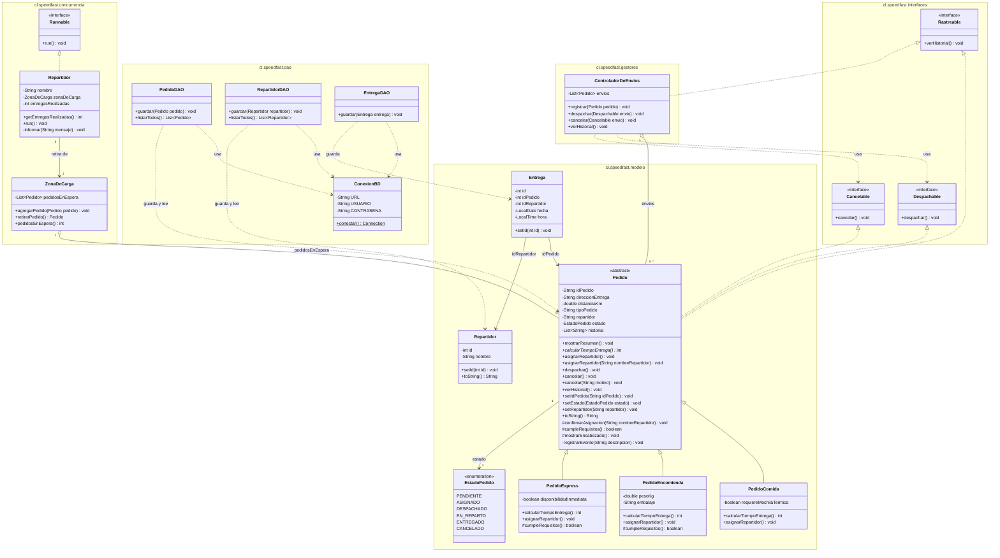

# SpeedFast

Sistema de gestión de pedidos para una empresa de reparto a domicilio.

Cada tipo de pedido estima su tiempo de entrega con una fórmula propia y aplica su propio criterio de asignación de repartidor. Un controlador de envíos despacha, cancela y consulta el historial a través de los contratos que implementan los pedidos.

La jornada de reparto se ejecuta de forma concurrente: los pedidos se depositan en una zona de carga común y varios repartidores los retiran en paralelo, sin que un pedido sea entregado dos veces.

El sistema se opera desde una interfaz gráfica Java Swing que permite registrar pedidos y repartidores, consultar el listado de pedidos y registrar entregas. La información se almacena en una base de datos MySQL, a la que la aplicación accede mediante JDBC.

## Requisitos

- JDK 21
- IntelliJ IDEA
- MySQL 8
- MySQL Connector/J 9.3.0, incluido en `lib/`

## Estructura

```
SpeedFast/
├── bd/
│   └── script_estructura.sql
├── lib/
│   └── mysql-connector-j-9.3.0.jar
├── src/
│   └── cl/
│       └── speedfast/
│           ├── interfaces/
│           │   ├── Despachable.java
│           │   ├── Cancelable.java
│           │   ├── Rastreable.java
│           │   └── package-info.java
│           ├── modelo/
│           │   ├── Pedido.java
│           │   ├── PedidoComida.java
│           │   ├── PedidoEncomienda.java
│           │   ├── PedidoExpress.java
│           │   ├── EstadoPedido.java
│           │   ├── Repartidor.java
│           │   ├── Entrega.java
│           │   └── package-info.java
│           ├── dao/
│           │   ├── ConexionBD.java
│           │   ├── PedidoDAO.java
│           │   ├── RepartidorDAO.java
│           │   ├── EntregaDAO.java
│           │   └── package-info.java
│           ├── gestores/
│           │   ├── ControladorDeEnvios.java
│           │   └── package-info.java
│           ├── concurrencia/
│           │   ├── ZonaDeCarga.java
│           │   ├── Repartidor.java
│           │   └── package-info.java
│           ├── vista/
│           │   ├── CampoValidado.java
│           │   ├── Validaciones.java
│           │   ├── VentanaPrincipal.java
│           │   ├── VentanaRegistroPedido.java
│           │   ├── VentanaRegistroRepartidor.java
│           │   ├── VentanaListaPedidos.java
│           │   └── package-info.java
│           └── main/
│               ├── Main.java
│               └── package-info.java
├── .idea/
├── SpeedFast.iml
└── README.md
```

| Paquete | Contenido |
|---|---|
| `cl.speedfast.interfaces` | Contratos de comportamiento |
| `cl.speedfast.modelo` | Modelo de dominio: pedidos, repartidores y entregas |
| `cl.speedfast.dao` | Conexión JDBC y acceso a las tablas |
| `cl.speedfast.gestores` | Coordinación de las operaciones sobre los envíos |
| `cl.speedfast.concurrencia` | Recurso compartido y ejecución concurrente de las entregas |
| `cl.speedfast.vista` | Ventanas Swing |
| `cl.speedfast.main` | Punto de entrada |

| Carpeta | Contenido |
|---|---|
| `bd/` | Script de creación de la base de datos `speedfast_db` |
| `lib/` | Driver JDBC de MySQL, enlazado como biblioteca del módulo en `SpeedFast.iml` |

## Modelo de clases

`PedidoComida`, `PedidoEncomienda` y `PedidoExpress` heredan de `Pedido`, que implementa las tres interfaces.

| Clase | Responsabilidad |
|---|---|
| `Pedido` | Clase abstracta. Datos y comportamiento comunes a todo pedido. |
| `PedidoComida` | Pedidos de restaurante. |
| `PedidoEncomienda` | Documentos y paquetes. |
| `PedidoExpress` | Compras de supermercado o farmacia. |
| `EstadoPedido` | Estados del pedido dentro del proceso de entrega. |
| `Repartidor` (`modelo`) | Repartidor registrado. Fila de la tabla `repartidor`. |
| `Entrega` | Relación entre un pedido y un repartidor, con fecha y hora. Fila de la tabla `entrega`. |
| `ConexionBD` | URL, credenciales y apertura de conexiones JDBC. |
| `PedidoDAO` | Inserción y consulta de pedidos. |
| `RepartidorDAO` | Inserción y consulta de repartidores. |
| `EntregaDAO` | Inserción de entregas. |
| `ControladorDeEnvios` | Registro de envíos, despacho, cancelación e historial. |
| `ZonaDeCarga` | Recurso compartido. Pedidos en espera de repartidor. |
| `Repartidor` (`concurrencia`) | Tarea concurrente. Retira pedidos de la zona de carga y los entrega. |
| `Main` | Punto de entrada. Abre la ventana principal. |



## Contratos

| Interfaz | Método | Implementada por |
|---|---|---|
| `Despachable` | `despachar()` | `Pedido` y sus tres subclases |
| `Cancelable` | `cancelar()` | `Pedido` y sus tres subclases |
| `Rastreable` | `verHistorial()` | `Pedido` y sus tres subclases, `ControladorDeEnvios` |

`ControladorDeEnvios` recibe los envíos como `Despachable` y `Cancelable`, sin depender del tipo concreto de pedido.

## Estados

| Estado | Significado |
|---|---|
| `PENDIENTE` | El pedido existe pero aún no tiene repartidor. |
| `ASIGNADO` | El pedido tiene un repartidor confirmado y puede despacharse. |
| `DESPACHADO` | El pedido salió a reparto y ya no admite cancelación. |
| `EN_REPARTO` | El pedido fue retirado de la zona de carga y va en camino a su destino. |
| `ENTREGADO` | El pedido llegó a su destino. |
| `CANCELADO` | El pedido fue anulado antes de salir a reparto. |

## Pedido (clase abstracta)

| Atributo | Tipo | Acceso |
|---|---|---|
| `idPedido` | `String` | lectura y escritura |
| `direccionEntrega` | `String` | lectura |
| `distanciaKm` | `double` | lectura |
| `tipoPedido` | `String` | lectura |
| `repartidor` | `String` | lectura y escritura |
| `estado` | `EstadoPedido` | lectura y escritura |
| `historial` | `List<String>` | consulta mediante `verHistorial()` |

| Firma | Visibilidad | Descripción |
|---|---|---|
| `mostrarResumen()` | `public` | Imprime la ficha del pedido. |
| `calcularTiempoEntrega()` | `public abstract` | Tiempo estimado de entrega, en minutos. |
| `asignarRepartidor()` | `public` | Asigna el repartidor según el criterio del tipo de pedido. |
| `asignarRepartidor(String)` | `public` | Asigna el pedido al repartidor indicado. |
| `despachar()` | `public` | Envía a reparto un pedido con repartidor asignado. |
| `cancelar()` | `public` | Cancela el pedido sin motivo. |
| `cancelar(String)` | `public` | Cancela el pedido con el motivo indicado. |
| `verHistorial()` | `public` | Imprime los eventos del pedido en orden de ocurrencia. |
| `setIdPedido(String)` | `public` | Registra el identificador asignado por la base de datos. |
| `setEstado(EstadoPedido)` | `public` | Actualiza el estado del pedido. |
| `setRepartidor(String)` | `public` | Registra al repartidor a cargo del pedido. |
| `toString()` | `public` | Tipo, identificador, destino y estado en una línea. |
| `confirmarAsignacion(String)` | `protected` | Confirmación común a ambas sobrecargas de `asignarRepartidor`. |
| `cumpleRequisitos()` | `protected` | Condición para asignar el pedido. |
| `mostrarEncabezado()` | `protected` | Imprime identificador, tipo y dirección. |

Cada asignación, despacho y cancelación queda anotada en el historial del pedido.

## Subclases

| Clase | Tiempo de entrega | Criterio de asignación | Repartidor automático | Atributos propios |
|---|---|---|---|---|
| `PedidoComida` | 15 min + 2 min por km | Mochila térmica | Makoto Kino | `requiereMochilaTermica: boolean` |
| `PedidoEncomienda` | 20 min + 1,5 min por km, redondeado | Peso de hasta 20 kg | Setsuna Meiou | `pesoKg: double`, `embalaje: String` |
| `PedidoExpress` | 10 min, más 5 min sobre 5 km | Disponibilidad inmediata | Hotaru Tomoe | `disponibilidadInmediata: boolean` |

Cada subclase implementa `calcularTiempoEntrega()` y sobrescribe `asignarRepartidor()` y `mostrarResumen()`. `PedidoEncomienda` y `PedidoExpress` sobrescriben además `cumpleRequisitos()`.

## ControladorDeEnvios

| Firma | Descripción |
|---|---|
| `registrar(Pedido)` | Incorpora un pedido a la gestión del controlador. |
| `getEnvios()` | Envíos registrados, en orden de incorporación. |
| `buscarIdRegistrado(String)` | Identificador ya en uso, sin distinguir mayúsculas de minúsculas. |
| `despachar(Despachable)` | Envía a reparto el envío indicado. |
| `cancelar(Cancelable)` | Anula el envío indicado. |
| `verHistorial()` | Imprime los pedidos entregados y su repartidor. |

## ZonaDeCarga

| Firma | Descripción |
|---|---|
| `agregarPedido(Pedido)` | Deposita un pedido a la espera de un repartidor. |
| `retirarPedido()` | Entrega el siguiente pedido en espera, o `null` si la zona está vacía. |
| `pedidosEnEspera()` | Cantidad de pedidos sin repartidor. |

Los tres métodos son `synchronized`.

## Repartidor

| Atributo | Tipo | Descripción |
|---|---|---|
| `nombre` | `String` | Nombre mostrado en consola. |
| `zonaDeCarga` | `ZonaDeCarga` | Zona compartida de la que retira pedidos. |
| `entregasRealizadas` | `int` | Entregas completadas durante el turno. |

| Firma | Descripción |
|---|---|
| `run()` | Retira y entrega pedidos hasta vaciar la zona de carga. |
| `getEntregasRealizadas()` | Entregas completadas por el repartidor. |

Por cada pedido retirado, `run()` lo marca `EN_REPARTO`, simula el trayecto con `Thread.sleep()` de entre 500 y 1500 ms y lo deja `ENTREGADO`.

## Concurrencia

| Aspecto | Resolución |
|---|---|
| Ejecución | `ExecutorService` con *pool* fijo de tres hilos |
| Recurso compartido | Una única instancia de `ZonaDeCarga` |
| Sección crítica | Comprobar si quedan pedidos y retirar uno |
| Mecanismo | Métodos `synchronized` sobre la zona de carga |
| Término | Espera acotada; vencido el plazo, las tareas se detienen |
| Interrupción | Se restaura la marca del hilo y el repartidor termina su turno |

La distribución de pedidos entre repartidores varía entre ejecuciones; cada pedido se entrega una sola vez.

## Base de datos

Base de datos MySQL `speedfast_db`, creada por `bd/script_estructura.sql`.

| Tabla | Columnas | Clave primaria | Claves foráneas |
|---|---|---|---|
| `repartidor` | `id`, `nombre` | `id`, `AUTO_INCREMENT` | — |
| `pedido` | `id`, `direccion`, `tipo`, `estado` | `id`, `AUTO_INCREMENT` | — |
| `entrega` | `id`, `id_pedido`, `id_repartidor`, `fecha`, `hora` | `id`, `AUTO_INCREMENT` | `id_pedido` → `pedido(id)`, `id_repartidor` → `repartidor(id)` |

Todas las columnas son `NOT NULL`. Un repartidor puede realizar muchas entregas y un pedido puede tener una o varias; cada entrega corresponde a un pedido y a un repartidor.

| Columna | Valores |
|---|---|
| `pedido.tipo` | `COMIDA`, `ENCOMIENDA`, `EXPRESS` |
| `pedido.estado` | Nombre del valor de `EstadoPedido` |

La distancia y los datos propios de cada tipo de pedido no se almacenan. Un pedido leído desde la base de datos los recibe con valores neutros.

### Conexión

| Parámetro | Valor |
|---|---|
| Clase | `ConexionBD` |
| Método | `conectar()`, mediante `DriverManager` |
| URL | `jdbc:mysql://localhost:3306/speedfast_db` |
| Usuario | `root` |
| Contraseña | Constante `CONTRASENA` de `ConexionBD` |

### Acceso a datos

| Clase | Método | SQL | Resultado |
|---|---|---|---|
| `PedidoDAO` | `guardar(Pedido)` | `INSERT` | Asigna al pedido el ID generado |
| `PedidoDAO` | `listarTodos()` | `SELECT` | `List<Pedido>` |
| `RepartidorDAO` | `guardar(Repartidor)` | `INSERT` | Asigna al repartidor el ID generado |
| `RepartidorDAO` | `listarTodos()` | `SELECT` | `List<Repartidor>` |
| `EntregaDAO` | `guardar(Entrega)` | `INSERT` | Asigna a la entrega el ID generado |

Las operaciones usan `PreparedStatement` y cierran conexión, sentencia y `ResultSet` con *try-with-resources*. Ante un error, el DAO relanza la `SQLException` con el nombre de la operación fallida y la ventana la informa al usuario.

## Interfaz gráfica

| Ventana | Rol |
|---|---|
| `VentanaPrincipal` | Accesos a las operaciones del sistema |
| `VentanaRegistroPedido` | Alta de pedidos |
| `VentanaRegistroRepartidor` | Alta de repartidores |
| `VentanaListaPedidos` | Listado de pedidos y registro de entregas |
| `CampoValidado` | Campo de formulario con validación mientras se escribe |
| `Validaciones` | Reglas de validación combinables |

### VentanaPrincipal

| Acción | Destino | Pedidos que presenta | Operaciones |
|---|---|---|---|
| Registrar pedido | `VentanaRegistroPedido` | | Alta de pedidos |
| Registrar repartidor | `VentanaRegistroRepartidor` | | Alta de repartidores |
| Listar pedidos | `VentanaListaPedidos` | Todos | Solo consulta |
| Registrar entrega | `VentanaListaPedidos` | Pendientes o asignados | Registro de entrega |

Cada ventana se crea una vez y se reutiliza en las aperturas siguientes.

### VentanaRegistroPedido

Solicita dirección, distancia y tipo de pedido, más los campos propios del tipo, que se muestran mediante un `CardLayout`. El identificador lo genera la base de datos y se informa en el mensaje de confirmación.

| Tipo | Campos propios |
|---|---|
| Comida | Requiere mochila térmica |
| Encomienda | Peso en kilos y embalaje |
| Express | Disponibilidad inmediata |

| Dato | Condiciones |
|---|---|
| Dirección de entrega | Obligatoria · entre 5 y 120 caracteres · debe incluir letras |
| Distancia | Obligatoria · número finito entre 0,1 y 100 |
| Peso | Obligatorio · número finito entre 0,1 y 100 |
| Embalaje | Obligatorio · entre 3 y 50 caracteres · debe incluir letras |

Los campos numéricos admiten coma o punto decimal. Un peso superior a `PedidoEncomienda.PESO_MAXIMO_KG` muestra un aviso en ámbar sin impedir el registro.

*Guardar* valida los campos exigibles, enfoca el primero pendiente y, con datos válidos, guarda el pedido en estado `PENDIENTE` mediante `PedidoDAO.guardar(Pedido)`.

### VentanaRegistroRepartidor

Solicita el nombre del repartidor y lo guarda mediante `RepartidorDAO.guardar(Repartidor)`. El nombre es obligatorio, tiene entre 3 y 100 caracteres y debe incluir letras.

### Validaciones

| Regla | Exigencia |
|---|---|
| `obligatorio(mensaje)` | El campo tiene contenido |
| `longitudEntre(min, max)` | La extensión está dentro del rango |
| `contieneLetras(mensaje)` | El texto incluye al menos una letra |
| `numeroEntre(concepto, min, max)` | Es un número finito dentro del rango |

`Validaciones.todas(...)` combina reglas y devuelve el primer motivo de rechazo. Salvo `obligatorio`, las reglas aceptan el campo vacío.

### CampoValidado

Agrupa etiqueta, cuadro de texto y mensaje. Un `DocumentListener` aplica la regla ante cada cambio del contenido.

| Situación | Comportamiento |
|---|---|
| Formulario recién abierto o limpiado | Sin advertencias |
| Valor inaceptable | Borde rojo y motivo bajo el campo |
| Valor aceptable con aviso | Borde y mensaje en ámbar |
| Valor corregido | Se retiran el borde y el mensaje |
| Cambio de tipo de pedido | Los campos que dejan de ser exigibles descartan su advertencia |

### VentanaListaPedidos

`JTable` con `DefaultTableModel` de celdas no editables, cargado desde `PedidoDAO.listarTodos()`.

| Columna | Columna SQL |
|---|---|
| ID | `pedido.id` |
| Tipo | `pedido.tipo` |
| Dirección | `pedido.direccion` |
| Estado | `pedido.estado` |

| Alcance | Pedidos | Acciones |
|---|---|---|
| `mostrarTodos()` | Todos | Ninguna |
| `mostrarPorGestionar()` | `PENDIENTE` o `ASIGNADO` | Registrar entrega |

La tabla se recarga al abrirse, al pulsar *Actualizar* y al registrar un pedido, y conserva la selección por ID.

*Registrar entrega* presenta en un `JComboBox` los repartidores obtenidos con `RepartidorDAO.listarTodos()` y guarda la entrega del pedido seleccionado con `EntregaDAO.guardar(Entrega)`, con la fecha y hora actuales.

## Diseño

| Aspecto | Resolución |
|---|---|
| Reutilización | `Pedido` concentra lo común; las subclases definen fórmula de tiempo, criterio de asignación y requisitos. Ambas sobrecargas de `asignarRepartidor` confirman en `confirmarAsignacion(String)`. |
| Escalabilidad | Un tipo de pedido nuevo hereda de `Pedido` e implementa `calcularTiempoEntrega()`; su persistencia requiere agregar su código de tipo en `PedidoDAO`. Cada interfaz declara un solo método. |
| Acceso al recurso compartido | `retirarPedido()` es `synchronized` completo: la comprobación y el retiro son indivisibles. |
| Estados | El enum `EstadoPedido` concentra las transiciones válidas en `despachar()` y `cancelar()`. |
| Separación de responsabilidades | Reglas de negocio en el modelo, acceso a datos en los DAO, coordinación en el gestor, concurrencia en `ZonaDeCarga` y `Repartidor`, e interacción con el usuario en la vista. Las ventanas no contienen SQL. |

## Ejecución

La base de datos se crea con `bd/script_estructura.sql` y la contraseña del usuario `root` se define en `ConexionBD`. `Main` abre `VentanaPrincipal` en el hilo de despacho de eventos de Swing.

```bash
javac -encoding UTF-8 -cp lib/mysql-connector-j-9.3.0.jar -d out/production/SpeedFast src/cl/speedfast/interfaces/*.java src/cl/speedfast/modelo/*.java src/cl/speedfast/dao/*.java src/cl/speedfast/gestores/*.java src/cl/speedfast/concurrencia/*.java src/cl/speedfast/vista/*.java src/cl/speedfast/main/*.java
```

```bash
java -cp "out/production/SpeedFast;lib/mysql-connector-j-9.3.0.jar" cl.speedfast.main.Main
```

## Escenarios de prueba

| Escenario | Acción | Resultado esperado |
|---|---|---|
| Registro de pedido | Guardar un pedido válido de cada tipo | Confirmación con el ID generado; fila en `pedido` con estado `PENDIENTE` |
| Listado | Abrir *Listar pedidos* | La tabla muestra las filas de `pedido` |
| Persistencia | Cerrar y volver a abrir la aplicación | El listado conserva los pedidos |
| Registro de repartidor | Guardar un repartidor válido | Confirmación con el ID generado; fila en `repartidor` |
| Registro de entrega | Registrar la entrega de un pedido seleccionado | Fila en `entrega` con pedido, repartidor, fecha y hora |
| Entrega sin repartidores | Registrar una entrega con la tabla `repartidor` vacía | Aviso de que no hay repartidores registrados |
| Entrega sin selección | Registrar una entrega sin fila seleccionada | Aviso de selección requerida |
| Integridad referencial | Insertar una entrega con un pedido o repartidor inexistente | Rechazo por clave foránea |
| Credenciales incorrectas | Conectar con una contraseña errónea | Error de acceso denegado |
| Servidor no disponible | Operar con MySQL detenido | Error de conexión; el formulario conserva sus datos |
| Formulario incompleto | Guardar con campos vacíos | Campos exigibles marcados y foco en el primero |
| Dato no numérico | Escribir texto en distancia o peso | Campo marcado en rojo |
| Cantidad fuera de rango | Escribir cero, un negativo o un valor sobre el máximo | Campo marcado en rojo con el rango admitido |
| Dirección sin calle | Escribir solo números en la dirección | Campo marcado en rojo |
| Encomienda con sobrepeso | Escribir un peso mayor a 20 kg | Aviso en ámbar; el registro se permite |
| Cambio de tipo | Alternar el tipo de pedido | Se muestran los campos del tipo elegido |
| Nombre de repartidor inválido | Guardar un nombre vacío o solo numérico | Campo marcado en rojo |
| Modo de consulta | Abrir *Listar pedidos* | Sin botón de registro de entrega |

## Autora

Kamila Villablanca

## Contexto

Proyecto desarrollado para la asignatura Desarrollo Orientado a Objetos II, Duoc UC.
