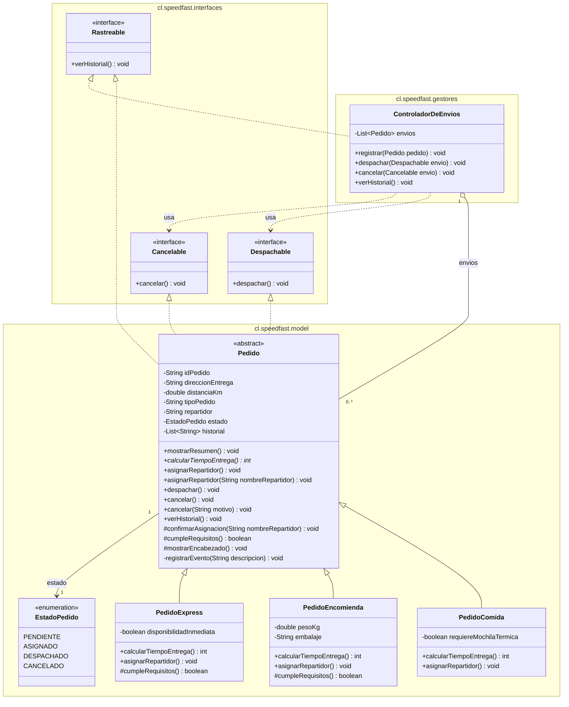

# SpeedFast

Sistema de gestión de pedidos para una empresa de reparto a domicilio.

Cada tipo de pedido estima su tiempo de entrega con una fórmula distinta y aplica su propio criterio de asignación de repartidor. Un controlador de envíos despacha, cancela y consulta el historial trabajando únicamente contra los contratos que los pedidos implementan.

## Requisitos

- JDK 21
- IntelliJ IDEA

## Estructura

```
SpeedFast/
├── src/
│   └── cl/
│       └── speedfast/
│           ├── interfaces/
│           │   ├── Despachable.java
│           │   ├── Cancelable.java
│           │   ├── Rastreable.java
│           │   └── package-info.java
│           ├── model/
│           │   ├── Pedido.java
│           │   ├── PedidoComida.java
│           │   ├── PedidoEncomienda.java
│           │   ├── PedidoExpress.java
│           │   ├── EstadoPedido.java
│           │   └── package-info.java
│           ├── gestores/
│           │   ├── ControladorDeEnvios.java
│           │   └── package-info.java
│           └── main/
│               ├── Main.java
│               └── package-info.java
├── .idea/
├── SpeedFast.iml
└── README.md
```

| Paquete | Contenido |
|---|---|
| `cl.speedfast.interfaces` | Contratos de comportamiento |
| `cl.speedfast.model` | Modelo de dominio: la jerarquía de pedidos |
| `cl.speedfast.gestores` | Coordinación de las operaciones sobre los envíos |
| `cl.speedfast.main` | Punto de entrada de la aplicación |

## Modelo de clases

`PedidoComida`, `PedidoEncomienda` y `PedidoExpress` heredan de `Pedido`, que implementa las tres interfaces.

| Clase | Responsabilidad |
|---|---|
| `Pedido` | Clase abstracta. Datos y comportamiento comunes a todo pedido. |
| `PedidoComida` | Pedidos de restaurante. |
| `PedidoEncomienda` | Documentos y paquetes. |
| `PedidoExpress` | Compras de supermercado o farmacia. |
| `EstadoPedido` | Estados del pedido dentro del proceso de entrega. |
| `ControladorDeEnvios` | Registra los envíos y coordina despacho, cancelación e historial. |
| `Main` | Punto de entrada. Ejecuta los escenarios de prueba. |




## Contratos

Cada interfaz declara una capacidad independiente. Una clase asume solo las que le corresponden y quien las consume no depende de implementaciones concretas.

| Interfaz | Método | Implementada por |
|---|---|---|
| `Despachable` | `despachar()` | `Pedido` y sus tres subclases |
| `Cancelable` | `cancelar()` | `Pedido` y sus tres subclases |
| `Rastreable` | `verHistorial()` | `Pedido` y sus tres subclases, `ControladorDeEnvios` |

Cada pedido rastrea sus propios eventos; el controlador rastrea las entregas realizadas.

`ControladorDeEnvios` recibe los envíos como `Despachable` y `Cancelable`, de modo que no conoce el tipo concreto del pedido que opera.

## Estados

| Estado | Significado |
|---|---|
| `PENDIENTE` | El pedido existe pero aún no tiene repartidor. |
| `ASIGNADO` | El pedido tiene un repartidor confirmado y puede despacharse. |
| `DESPACHADO` | El pedido salió a reparto y ya no admite cancelación. |
| `CANCELADO` | El pedido fue anulado antes de salir a reparto. |

## Pedido (clase abstracta)

Los atributos se reciben en el constructor y se exponen mediante *getters*. Solo `direccionEntrega` admite modificación posterior.

| Atributo | Tipo | Acceso |
|---|---|---|
| `idPedido` | `String` | lectura |
| `direccionEntrega` | `String` | lectura y escritura |
| `distanciaKm` | `double` | lectura |
| `tipoPedido` | `String` | lectura |
| `repartidor` | `String` | lectura |
| `estado` | `EstadoPedido` | lectura |
| `historial` | `List<String>` | consulta mediante `verHistorial()` |

### Métodos

| Firma | Visibilidad | Descripción |
|---|---|---|
| `mostrarResumen()` | `public` | Imprime la ficha del pedido: tipo, identificador, dirección, distancia, repartidor, tiempo estimado y estado. |
| `calcularTiempoEntrega()` | `public abstract` | Tiempo estimado de entrega, en minutos. |
| `asignarRepartidor()` | `public` | Aplica el criterio de asignación del pedido y asigna el repartidor que le corresponde. |
| `asignarRepartidor(String)` | `public` | Asigna manualmente el pedido al repartidor indicado. |
| `despachar()` | `public` | Envía a reparto un pedido con repartidor asignado. |
| `cancelar()` | `public` | Cancela el pedido sin dejar constancia de un motivo. |
| `cancelar(String)` | `public` | Cancela el pedido dejando constancia del motivo. |
| `verHistorial()` | `public` | Imprime los eventos registrados por el pedido, en orden de ocurrencia. |
| `confirmarAsignacion(String)` | `protected` | Punto único de confirmación que comparten ambas sobrecargas. |
| `cumpleRequisitos()` | `protected` | Condición que debe cumplir el pedido para ser asignado. |
| `mostrarEncabezado()` | `protected` | Imprime el identificador, tipo y dirección del pedido. |

Cada asignación, despacho y cancelación queda anotada en el historial del pedido.

## Subclases

Cada subclase implementa `calcularTiempoEntrega()` y sobrescribe `asignarRepartidor()`.

| Clase | Tiempo de entrega | Criterio de asignación | Repartidor automático | Atributos propios |
|---|---|---|---|---|
| `PedidoComida` | 15 min + 2 min por km | El repartidor debe contar con mochila térmica | Makoto Kino | `requiereMochilaTermica: boolean` |
| `PedidoEncomienda` | 20 min + 1,5 min por km, ajustado a entero | Peso dentro del límite de 20 kg | Setsuna Meiou | `pesoKg: double`, `embalaje: String` |
| `PedidoExpress` | 10 min, más 5 min si la distancia supera los 5 km | Repartidor cercano con disponibilidad inmediata | Hotaru Tomoe | `disponibilidadInmediata: boolean` |

`PedidoEncomienda` y `PedidoExpress` sobrescriben además `cumpleRequisitos()`.

## ControladorDeEnvios

| Firma | Descripción |
|---|---|
| `registrar(Pedido)` | Incorpora un pedido a la gestión del controlador. |
| `despachar(Despachable)` | Envía a reparto el envío indicado. |
| `cancelar(Cancelable)` | Anula el envío indicado. |
| `verHistorial()` | Imprime las entregas realizadas y el repartidor que se hizo cargo de cada una. |

## Diseño

El sistema se organiza en torno a tres piezas: una clase abstracta que reúne lo común a todo pedido, tres contratos de comportamiento y un gestor que opera sobre esos contratos.

### Reutilización

La clase `Pedido` reúne los atributos y el comportamiento que comparten los tres tipos de pedido: los datos del envío, el resumen, la asignación de repartidor, el despacho, la cancelación y el historial. Las subclases definen únicamente aquello que cambia entre un tipo y otro: la fórmula del tiempo de entrega, el criterio de asignación y la condición que debe cumplirse para asignar.

Las dos versiones de `asignarRepartidor` terminan llamando al mismo método `confirmarAsignacion(String)`. Con esto, la regla de que un pedido solo se asigna si cumple sus requisitos queda escrita una sola vez y se aplica por igual en la asignación automática y en la manual.

### Escalabilidad

Para incorporar un cuarto tipo de pedido basta con heredar de `Pedido` e implementar `calcularTiempoEntrega()`. El despacho, la cancelación y el historial ya vienen resueltos en la clase base. No es necesario modificar ninguna clase existente, tampoco el controlador: como `ControladorDeEnvios` recibe los envíos declarados como `Despachable` y `Cancelable`, puede operar sobre el tipo nuevo sin conocerlo.

Las capacidades también pueden crecer por separado. Cada interfaz declara un solo método, de manera que una clase que en el futuro solo necesite cancelarse implementa `Cancelable` sin asumir las demás responsabilidades.

### Mantenibilidad

Las responsabilidades están repartidas entre los paquetes: las reglas de negocio en el modelo, la coordinación de los envíos en el gestor y la simulación en `Main`.

El estado del pedido se modela con el enum `EstadoPedido` y no con banderas booleanas separadas. De esta forma un pedido no puede quedar cancelado y despachado a la vez, y las transiciones válidas quedan concentradas en `despachar()` y `cancelar()`. Un cambio en la manera de cancelar tampoco obliga a modificar las clases que solo necesitan consultar el historial.

## Ejecución

Desde IntelliJ IDEA, ejecutar `Main`.

Desde la línea de comandos:

```bash
javac -encoding UTF-8 -d out/production/SpeedFast src/cl/speedfast/interfaces/*.java src/cl/speedfast/model/*.java src/cl/speedfast/gestores/*.java src/cl/speedfast/main/*.java
```

```bash
java -cp out/production/SpeedFast cl.speedfast.main.Main
```

## Escenarios de prueba

`Main` registra cinco pedidos en el controlador —uno de cada tipo, más una encomienda que excede el peso permitido y una compra express sin disponibilidad— y ejecuta seis bloques:

1. `mostrarResumen()` sobre cada pedido, seguido de una tabla comparativa de tiempos estimados.
2. `asignarRepartidor()` sobre cada pedido. Cada tipo aplica su criterio y asigna su repartidor; los dos pedidos que no lo superan quedan derivados a revisión.
3. `asignarRepartidor(String)` sobre un pedido válido y uno rechazado. Los demás conservan el repartidor que les asignó el sistema.
4. Despacho de los cinco envíos a través del controlador. Solo salen a reparto los que tienen repartidor asignado.
5. Cancelación de un pedido ya despachado, que se rechaza; de un pedido pendiente indicando el motivo; y de otro sin motivo informado.
6. Historial de entregas realizadas según el controlador, y seguimiento detallado de los cinco pedidos.

## Autora

Kamila Villablanca

## Contexto

Proyecto desarrollado para la asignatura Desarrollo Orientado a Objetos II, Duoc UC.
